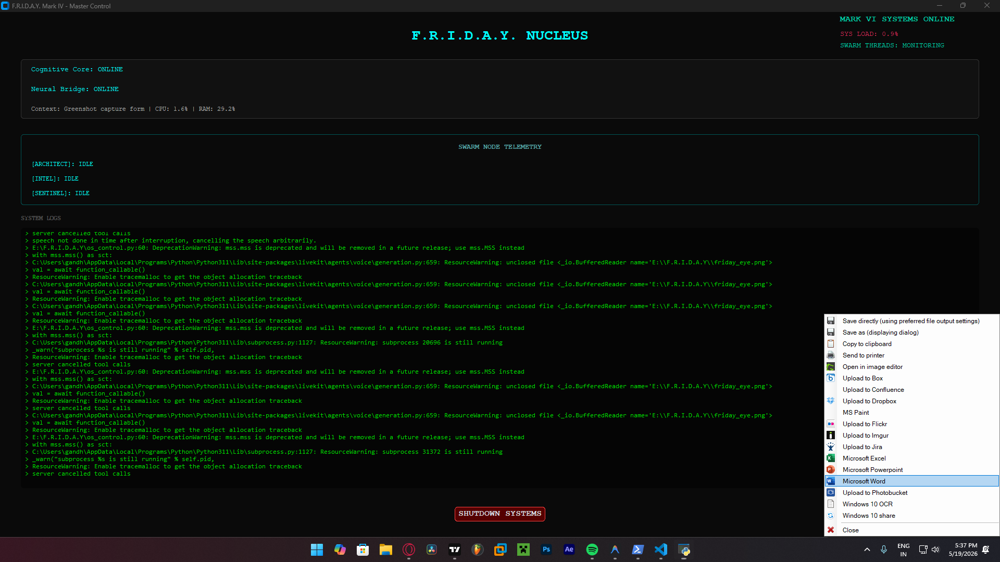
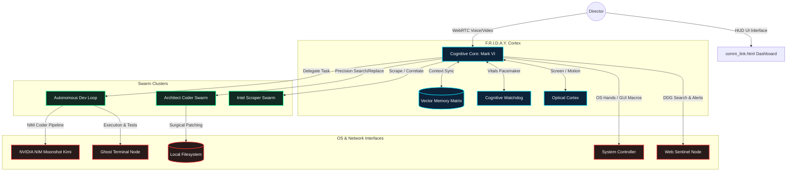

#  F.R.I.D.A.Y. — Mark VI Intent Engine

[](https://www.python.org/)
[](https://build.nvidia.com/)
[](https://livekit.io/)
[](https://www.trychroma.com/)
[]()

> *"Director, the Swarm is online. System vitals are green. Standing by for command."*

**F.R.I.D.A.Y. (Fully Responsive Intelligent Designing Assistant System)** is an autonomous, proactive, Stark-inspired **Intent Engine** and multi-agent swarm architecture. Far beyond a simple voice assistant, it merges hardware-level OS control, real-time WebRTC audio/video links, visual monitor analysis, and self-healing codebase generation into a single cognitive core. 

By offloading compute to advanced **NVIDIA NIM clusters** (leveraging Moonshot Kimi-k2.6) and coordinating through a unified **FastAPI Master Hive Router**, F.R.I.D.A.Y. can plan, code, test, deploy, and self-heal complex full-stack features asynchronously while maintaining active interaction.

---

## 🌌 System Architecture



---

## 🛠️ Main Pillars & Key Features

### 1. The Autonomous Development Pipeline ("The God-Loop")
*   **Architect Swarm Planning:** Generates complex step-by-step development plans.
*   **The Ironclad JSON Extractor:** Powered by a robust parser incorporating Markdown cleanup, native list fallback extraction, brackets regex isolation, and Python AST-evaluation to ensure flawless parsing of architectural steps from LLM outputs.
*   **Surgical Precision Patches:** Rather than full rewrites, F.R.I.D.A.Y. writes Search-and-Replace JSON patches to precisely modify lines of code, avoiding whitespace mismatch.
*   **Self-Healing Loop (CI/CD):** Natively compiles and executes test files, capturing stdout/stderr and feeding tracebacks back to NVIDIA NIMs to autonomously patch bugs over 3 refinement attempts.

### 2. Cognitive Core & WebRTC Bridge
*   **Zero-Latency WebRTC Link:** Integrates **LiveKit Agents API** and **Silero VAD** for bidirectional, interruption-friendly voice conversation.
*   **Dynamic Pacemaker (Cognitive Watchdog):** Acts as a background watchdog that silently monitor-sweeps active async tasks. Purges dead queues and releases OS locks if tasks stall (>60s) without interrupting voice feeds.
*   **Manual Defibrillator:** Instantly forces python garbage collection and frees active locks via tool-call in case of state collision.

### 3. Optical Cortex (Vision Feed)
*   **Motion-Adaptive Capture:** Dynamically streams monitor inputs at 360p WebRTC source. Slows capture to save bandwidth if monitor changes by <5%, but increases frame rates during motion.
*   **Visual Sub-Agent Screen Inspection:** Allows F.R.I.D.A.Y. to inspect what you are currently viewing to provide context-aware developer help or UI/UX styling suggestions.

### 4. Memory Vault & Temporal Retrieval
*   **Vector Memory Matrix:** Implements local persistent semantic indexing using SQLite/ChromaDB.
*   **Temporal Sessions Lookup:** Restores workspaces by recalling past topics and automatically loading associated code files in VS Code via absolute paths.
*   **Subconscious Timeline Journaling:** Silently logs completed developer actions and workspace changes.

### 5. OS & Hardware Controller
*   **GUI Mastery:** Controls mouse focus, types keys natively, runs hotkeys, and manages system master volumes.
*   **Global Sonar Search:** Performs recursive drive sweeps to automatically map and register untracked directories, bypassing Windows shell permission walls.
*   **Macro Protocol Builder:** Saves multi-step tool routines (e.g. "Morning Protocol") to trigger custom sequences sequentially.

---

## 📂 File Registry Map

| Core Module | Description |
| :--- | :--- |
| **`cognitive_core.py`** | The central nervous system initializing vector matrices, registering tools, and maintaining LiveKit Realtime voice bridges. |
| **`autonomous_pipeline.py`** | Coordinates the plan-execute-verify self-healing cycle. Integrates **The Ironclad JSON Extractor**. |
| **`swarm_nodes.py`** | Outsources codebase analysis, multi-file code editing, and full workspace refactoring to specialized sub-agents. |
| **`nvidia_nim_node.py`** | Async router managing HTTP calls to NVIDIA's high-speed Moonshot Kimi-k2.6 endpoint. |
| **`watchdog_node.py`** | A dynamic heartbeat watchdog protecting execution logic from deadlocks and process leakage. |
| **`vision_node.py`** | Manages `OpticalCortex` WebRTC video streaming and motion diff checks. |
| **`os_control.py`** | Facilitates direct Windows keyboard/mouse macros, file system overrides, volume manipulation, and explorer interactions. |
| **`memory_matrix.py`** | Handles persistent semantic database connections and journaling routines. |
| **`hive_router.py`** | A lightweight FastAPI central server displaying live status across the active Swarms. |
| **`comm_link.html`** | A glassmorphic HUD dashboard that visualizes active agents and network states. |

---

## ⚡ Quick-Start Installation

### Prerequisites
*   **OS:** Windows (preferred for native GUI/Speech commands)
*   **Python:** 3.11 or higher
*   **WebRTC:** [LiveKit Server](https://livekit.io/) account and credentials

### 1. Setup the Environment
Clone the repository:
```bash
git clone https://github.com/GandharAcharya/F.R.I.D.A.Y.git
cd F.R.I.D.A.Y
```

Create a Virtual Environment & Install Dependencies:
```powershell
python -m venv venv
venv\Scripts\activate
pip install -r requirements.txt
```

### 2. Configure Environment Variables
Create a `.env` file in the root directory (make sure this is NEVER pushed to git, it is locked inside `.gitignore`):
```ini
LIVEKIT_API_KEY="your_livekit_key"
LIVEKIT_API_SECRET="your_livekit_secret"
LIVEKIT_URL="your_livekit_server_websocket_url"
GOOGLE_API_KEY="your_gemini_api_key"
NVIDIA_API_KEY="your_nvidia_nim_api_key"
GMAIL_USER="your_email@gmail.com"
GMAIL_APP_PASSWORD="your_app_password"
```

### 3. Launching F.R.I.D.A.Y.
Start the FastAPI Master Hive Router in a background terminal:
```bash
python hive_router.py
```

Ignite the Cognitive Core Mark VI:
```bash
python cognitive_core.py
```

Launch the HUD Dashboard:
```bash
start comm_link.html
```

---

## 🔒 Security & Safe-Guards
*   **Project Firewalls:** Dynamic secure workspaces isolation (`E:\F.R.I.D.A.Y\Workspace`) prevents autonomous code execution from mutating main system files.
*   **Indentation Locks:** Precise Search-and-Replace regex engines abort files patches if whitespace alignment does not match, protecting files from corruption.
*   **Pacemaker Defibrillator:** Cognitive watchdog terminates runaway subprocesses and frees web drivers to avoid terminal stalling.

---

> Created under Stark-inspired developer protocols. Developed for extreme agentic automation.
